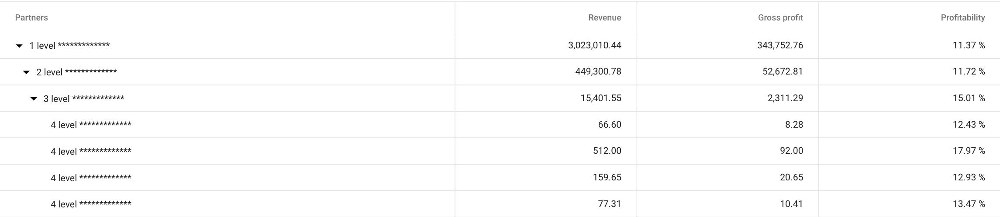

If you need to setup data properties of the ejs-treegrid table, or connect data, then this article will help you understand the initial setup.



## Installing the component ejs-treegrid

At the beginning we need to install the component ejs-treegrid. To save dependencies in package.json we can use the --save flag:

```
npm install @syncfusion/ej2-vue-treegrid --save
```

Registering the component:

```js
import { TreeGridPlugin } from '@syncfusion/ej2-vue-treegrid';

Vue.use(TreeGridPlugin);
```

Adding the component to the template:

```html
<ejs-treegrid :allowSorting='true' :sortSettings='sortSettings' :dataSource="data" childMapping="array" :treeColumnIndex='0' gridLines='Both' enableCollapseAll=true :loadChildOnDemand='true'></ejs-treegrid>
```

Let's take a look at each function.

## allowSorting and sortSettings

Function `allowSorting` allows to sorting table for columns.

```js
import { 
    TreeGridPlugin,
    Sort
} from '@syncfusion/ej2-vue-treegrid';
```

Add in application:

```js
export default {
  data() {
      return {
      name: "App",

      // Adding code to get data to methods: {} below
      data: [],

      // Data sorting permission for a column
      sortSettings: {columns: { field: 'Gross profit', direction: 'Descending' }},
  },
  mounted () {
    provide: {
        treegrid: [Sort]
    }
  },
  methods: {
      // Your code for get data
  }
```

## childMapping

Specifies which array will be the child:

```js
// ...
Vue.use(TreeGridPlugin);

let dataSource = [
    {
        taskID: 1,
        taskName: 'Design'
        array: [
            { taskID: 2, taskName: 'Software Specification' },
            { taskID: 3, taskName: 'Develop prototype' }
        ]
    },
    {
        taskID: 4,
        taskName: 'Implementation Phase',
        array: [
            {
                taskID: 5,
                taskName: 'Phase 1',
                array: [{
                        taskID: 6,
                        taskName: 'Implementation Module 1',
                        array: [
                            { taskID: 7, taskName: 'Development Task 1' },
                            { taskID: 8, taskName: 'Development Task 2' },
                            { taskID: 9, taskName: 'Testing' },
                            { taskID: 10, taskName: 'Bug fix' }
                        ]
                    }]
            }]
    }];

export default {
// ...
}
```

## treeColumnIndex

To expand or collapse child rows used the `treeColumnIndex` property, the number indicates the column to expand:

```html
<ejs-treegrid :treeColumnIndex='0'></ejs-treegrid>
```
    


## gridLines

Creating grid for table. There are 4 types of grid:

 - Horizontal
 - Vertical
 - Both
 - None

## enableCollapseAll

Expand or collapse all rows on init data

## loadChildOnDemand

If property `loadChildOnDemand` is true, parent records are render in expanded state.


