If you have a need to use new CAP technologies, and the database contains a lot of data, then you will need to replicate to SAP HANA Cloud. In this article, we will look at the complete setup using PostgreSQL without SSL as an example.

## Database preconfiguration

1) https://help.sap.com/docs/HANA_SMART_DATA_INTEGRATION/7952ef28a6914997abc01745fef1b607/f5e5dd27f7b1480ebdb392ce997b828a.html?locale=en-US

    In `postgresql.conf` change the values ​​to the following:

    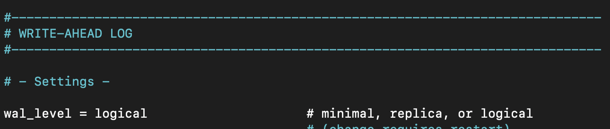
    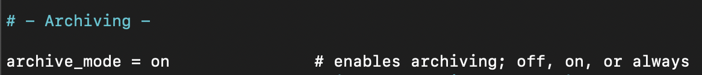
    

    `max_replication_slots = database_to_replication * 2`

2) Before registering the adapter, you need to install the database driver, information about this can be found at the bottom of the page (SAP HANA smart data integration and all its patches Product Availability Matrix (PAM) for SAP HANA SDI 2.0) by the address: 

    https://help.sap.com/viewer/7952ef28a6914997abc01745fef1b607/2.0_SPS06/en-US/f8a15f52581e4f908c296fb92d0bec61.html

3) Download the driver on the official website of the database. Then add the driver to the <DPAgent_root>/lib/ folder in .jar format

4) Register adapter. Section 9. Adapter Registration

## Installing Data Provisionig Agent

1) Downloading SDI Data Provisioning Agent on the site 

    https://tools.hana.ondemand.com/#cloudintegration

2) Unzip the archive and install it in the `/usr/sap/dataprovagent/` directory. Installation is performed from the root folder with the command:
    ```
        ./hdbinst --silent --batch --path="/usr/sap/dataprovagent" --agent_listener_port=5050 --agent_admin_port=5051
    ```

3) In the `<DPAgent_root>/bin/` folder, run the `dpagent_servicedaemon.sh` file through the code editor and comment out the `pingAgent` function:

    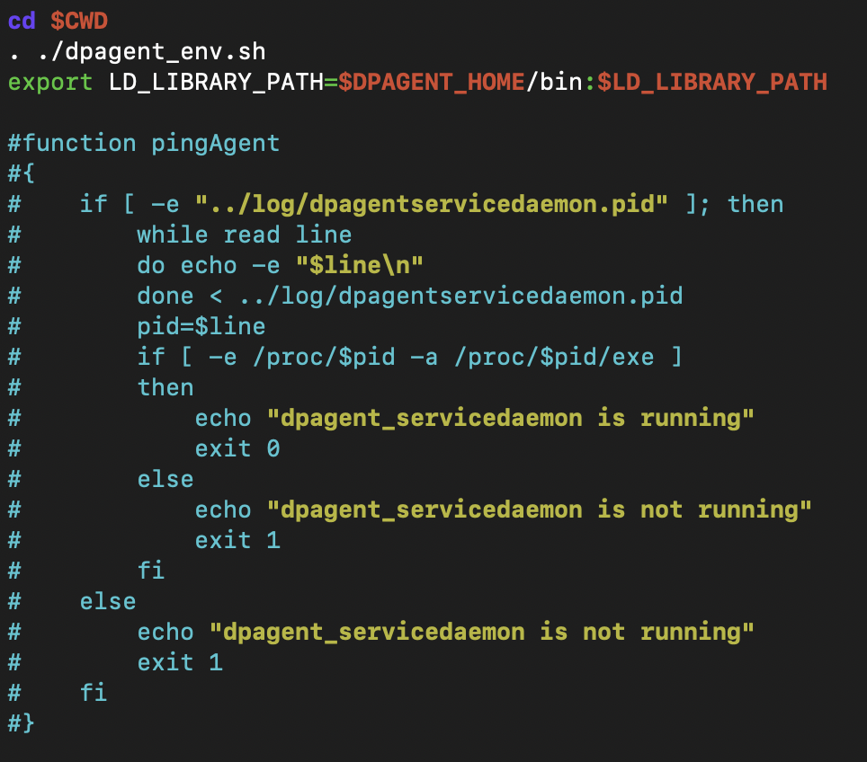

    Run the `dpagent_env.sh` file in the same folder and comment out the lines starting with “-e”:

    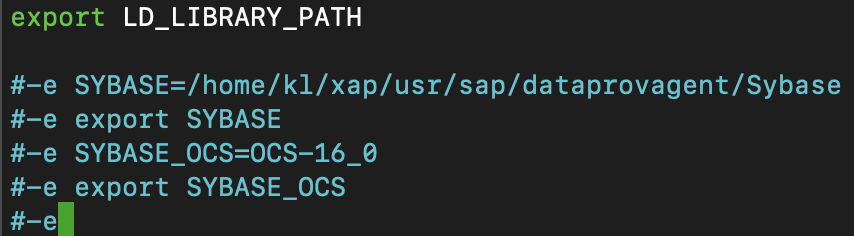

4) In the root folder `<DPAgent_root>`, open the `dpagentconfig.ini` file, change the line:
    ```
    hana.useSSL=false
    ```
## Configuring the Data Provisionig Agent
1) From the `<DPAgent_root>/bin/` folder, start the `Agent` with the command:
    ```
    ./agentcli.sh --configAgent
    ```
2) Start the Agent from section `2. Start or Stop Agent` 
    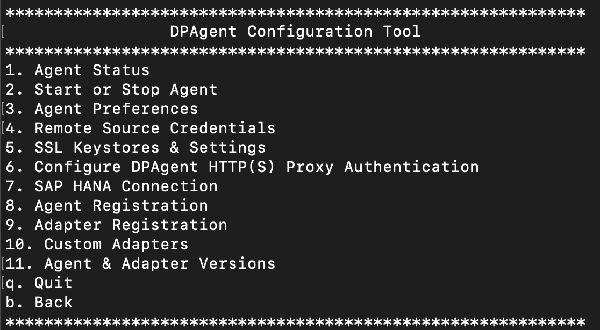

    Check the operability with the `Ping Agent` command
    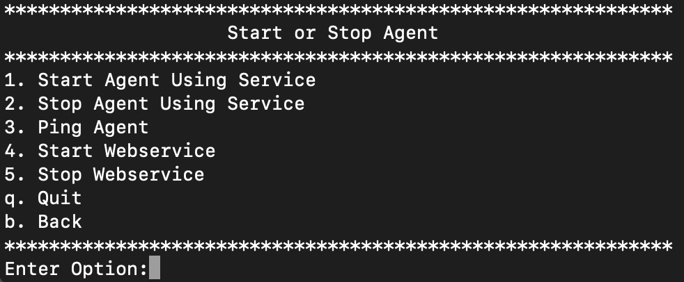

3) Set up communication between Agent and SAP HANA Cloud.
   Section 7. SAP HANA Connection
   

   Select 1. Connect to SAP HANA Cloud via JDBC
   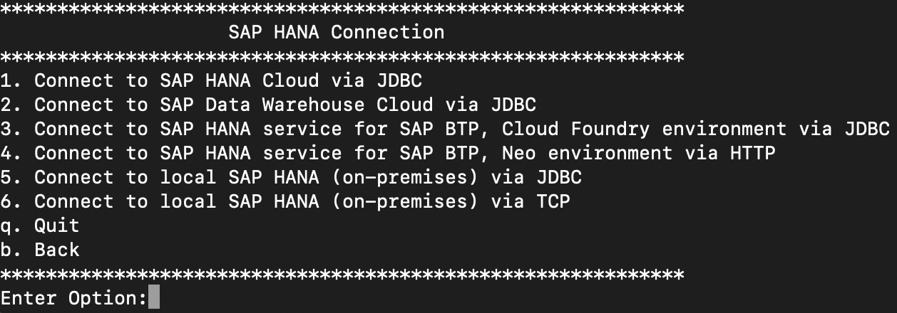

    a) Enter Use JDBC Encrypted Connection - set to true;

    b) Enter Host Name `********-****-****-****-**********.hana.prod-eu20.hanacloud.ondemand.com`;

    c) Enter Port Number (default database host port 443);

    d) Enter `Agent Admin HANA User` - enter the name of the database administrator (DBADMIN)
    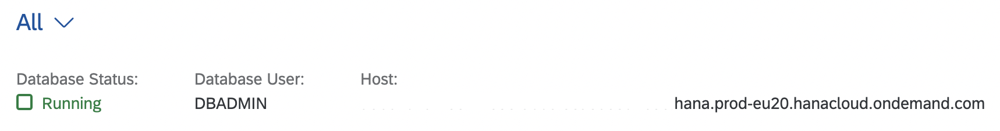

    e) Enter database password;

    f) Enter Use Proxy Server - select false if not using;

    g) Enter `HANA User Name` for `Agent Messaging` - a user name capable of sending an `Agent Message`, created in the `Database Explorer` in the SQL panel, with the command:

    ```
    CREATE USER <username> PASSWORD <password> NO FORCE_FIRST_PASSWORD_CHANGE SET USERGROUP DEFAULT;
    ```

    e) Enter user password.

4) Register Agent section `8.Agent Registration пункт 1`. Point 1 Register Agent
    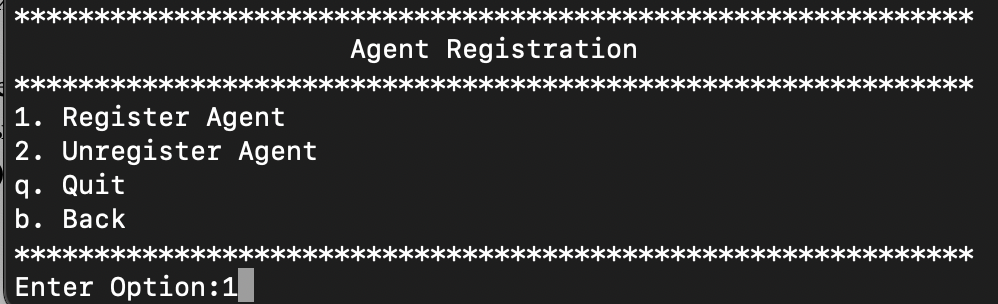

    a) Enter a new Agent name in the `Enter Agent Name` field

    b) Enter your hostname or external IP in the `Enter Agent Host Name` field

## Creating Remote Source

1) On the `SAP HANA Database Explorer` page, select a database, select Agents in the `Catalog` folder and check that the registered Agent is connected and receives data.

2) In the `Catalog` folder, select z and create using the GUI or using the SQL panel, the code can be found on the page:

    https://help.sap.com/viewer/7952ef28a6914997abc01745fef1b607/2.0_SPS05/en-US/6ed502701abd4d1ca94d463d7dc6e99f.html 

    in the section for a certain database there is a configuration code. Paste code in SQL Panel to `SAP HANA Database Explorer`.

Fill in the required fields Host, Port Number, Database Name. 
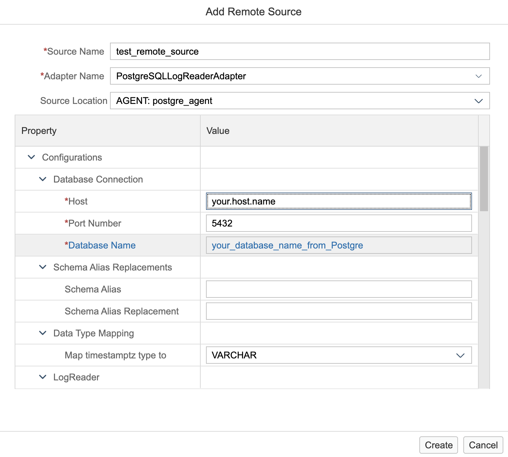

In the Credentials field select Credentials mode and fill in the required User Name and Password fields of your database
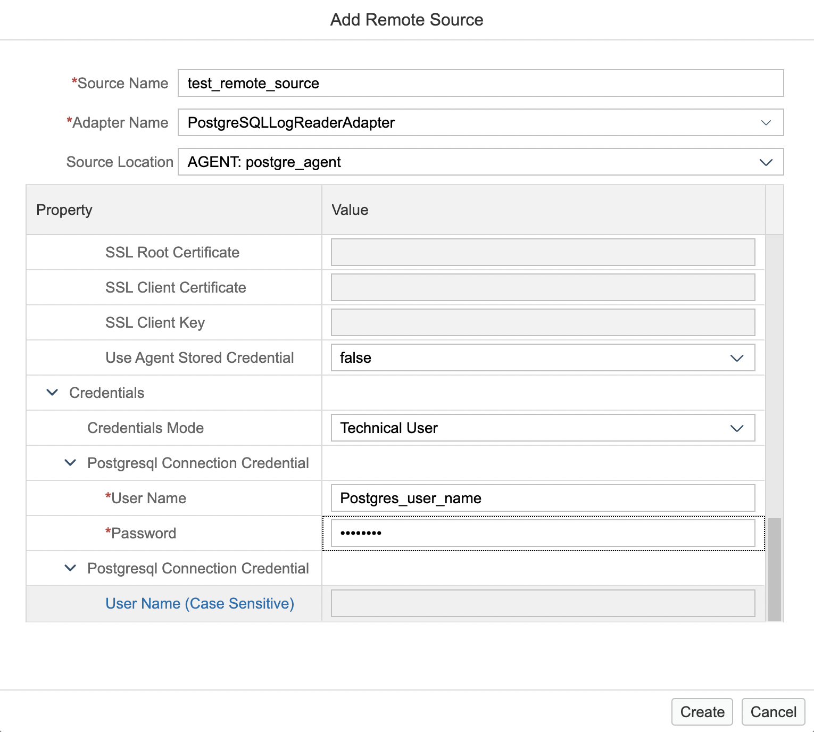
